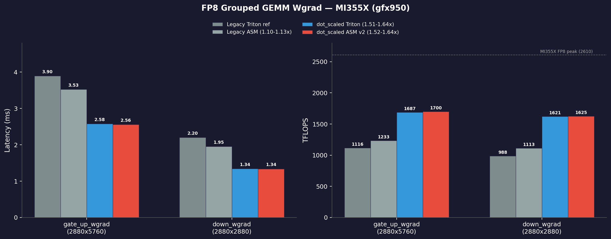

# FP8 Grouped GEMM Wgrad — ASM Optimization for MI355X

Hand-tuned AMDGCN assembly optimization of Triton's FP8 grouped GEMM weight-gradient kernel on MI355X (gfx950).

Two optimization tracks:
1. **Legacy MFMA** (\`v_mfma_f32_16x16x32_fp8_bf8\`): instruction scheduling on Triton's compiled output — **+10-16%**
2. **dot_scaled MFMA** (\`v_mfma_f32_32x32x64_f8f6f4\`): MI355X-native opcode with 8x FLOPs/instruction, plus ASM scheduling — **1.52-1.64x**

## Kernels

| Kernel | File | MFMA | Description |
|--------|------|------|-------------|
| **Legacy ref** | \`kernels/variable_k_gemm_ref.co\` | 16x16x32 fp8_bf8 | Triton-compiled baseline |
| **Legacy ASM** | \`kernels/variable_k_wgrad_mega.s\` | 16x16x32 fp8_bf8 | Hand-tuned, buffer_load hoisting + MOV removal |
| **dot_scaled ref** | \`kernels/dot_scaled_ref.s\` | 32x32x64 f8f6f4 | Triton \`tl.dot_scaled\` compiled baseline |
| **dot_scaled ASM** | \`kernels/dot_scaled_v2.s\` | 32x32x64 f8f6f4 | Hand-tuned, buffer_load hoisting + waitcnt optimization |

## Performance

MI355X (gfx950), ROCm 7.2.0. C launcher (co_compare.cpp), warmup=50, iters=200. FP8 (e4m3fnuz x e5m2fnuz) -> BF16.

### gate_up_wgrad (E=32, M=131072, OUT_M=2880, OUT_N=5760, 4.35 TFLOP)

| Kernel | Time (ms) | TFLOPS | vs Legacy ref |
|--------|-----------|--------|---------------|
| Legacy ref (Triton) | 3.587 | 1213 | 1.00x |
| Legacy ASM (mega) | 3.091 | 1407 | **1.16x** |
| dot_scaled Triton JIT | 2.578 | 1687 | 1.51x |
| **dot_scaled ASM v2** | **2.558** | **1700** | **1.52x** |

### down_wgrad (E=32, M=131072, OUT_M=2880, OUT_N=2880, 2.17 TFLOP)

| Kernel | Time (ms) | TFLOPS | vs Legacy ref |
|--------|-----------|--------|---------------|
| Legacy ref (Triton) | 1.864 | 1167 | 1.00x |
| Legacy ASM (mega) | 1.607 | 1353 | **1.16x** |
| dot_scaled Triton JIT | 1.341 | 1621 | 1.64x |
| **dot_scaled ASM v2** | **1.338** | **1625** | **1.64x** |

Correctness: cos=1.000, max_diff=0.031250 vs torch on both sites. dot_scaled ASM vs dot_scaled Triton: cos=1.000, max_diff=0.000 (bit-identical).

## Optimization Details

### Legacy MFMA (variable_k_wgrad_mega.s)

Five techniques discovered across 8 parallel agent sessions:

1. **RHS buffer_load hoisting (+10%)** — moved \`buffer_load_dwordx4\` from loop bottom to loop top into dead VGPRs v[216:223], extending HBM latency cover from ~120 to ~3500 cycles
2. **Redundant MOV elimination (+0.3%)** — removed 6 \`v_add_u32_e32 vX, 0, vY\` identity copies, freed registers for buffer_load hoisting
3. **ds_read overlap via v[138:139] (+1.6%)** — used dead scale-factor registers as rotating ds_read temps, eliminated ~40-cycle stalls per pair
4. **Loop tail restructure (+0.5%)** — moved 6 loop-control instructions to final MFMA co-execution window
5. **s_waitcnt vmcnt(0) before s_endpgm** — gfx950 stores can leak without explicit drain

### dot_scaled MFMA (dot_scaled_v2.s)

The big win is the opcode upgrade: \`v_mfma_f32_32x32x64_f8f6f4\` does 131,072 FLOPs per instruction (8x the legacy 16,384). Triton's \`tl.dot_scaled\` compiler generates this automatically. On top of the Triton JIT output:

1. **RHS buffer_load hoisting (+0.8%)** — moved first RHS prefetch \`buffer_load_dwordx4 v[122:125]\` from after MFMA #6 to after loop control (line 659), giving ~30 additional instructions of HBM latency cover. FIFO vmcnt drain order preserved.
2. **Redundant s_waitcnt lgkmcnt(0) removal** — removed a duplicate lgkmcnt(0) before s_barrier that was redundant since the previous lgkmcnt(0) had already drained all LDS reads with no new LDS ops issued between them.

### What was tried and rejected

- **s_setprio 3/0** around MFMA blocks — no benefit at occupancy=2, slight regression from extra instructions
- **MFMA reordering** (moving MFMA #8 before s_barrier) — consistent ~2% regression on gate_up_wgrad, barrier blocks MFMA execution
- **Loop tail restructuring** on dot_scaled — reduced performance when combined with buffer_load hoisting

## Reproduce

### Requirements

- MI355X GPU (gfx950)
- ROCm 6.x+ with \`llvm-mc\` (for assembly)

### C launcher (recommended, zero Python overhead)

\`\`\`bash
# Build
hipcc -O3 -o co_compare co_compare.cpp

# Assemble optimized kernel (patches .text into ref .co, preserving metadata)
python3 tools/patch_co.py kernels/variable_k_gemm_ref.co kernels/variable_k_wgrad_mega.s \
  kernels/variable_k_wgrad_mega.co --llvm-mc /opt/rocm/llvm/bin/llvm-mc

# Benchmark both sites
export HIP_VISIBLE_DEVICES=0
./co_compare kernels/variable_k_gemm_ref.co kernels/variable_k_wgrad_mega.co \
  --benchmark --warmup 50 --iters 200 --site gate_up_wgrad
./co_compare kernels/variable_k_gemm_ref.co kernels/variable_k_wgrad_mega.co \
  --benchmark --warmup 50 --iters 200 --site down_wgrad

# Benchmark ref kernel only
./co_compare kernels/variable_k_gemm_ref.co kernels/variable_k_gemm_ref.co \
  --benchmark --warmup 50 --iters 200 --site gate_up_wgrad
\`\`\`

### Python harness (requires primus docker, tests dot_scaled too)

\`\`\`bash
docker run --rm --network=host --device=/dev/kfd --device=/dev/dri \\
  --group-add video --ipc=host --cap-add=SYS_PTRACE \\
  --security-opt seccomp=unconfined \\
  -v \$(pwd):/workspace/ggemm \\
  --entrypoint /bin/bash rocm/primus:v26.2 -c "
cd /workspace/ggemm
python3 bench.py --kernel kernels/dot_scaled_v2.s --benchmark --site gate_up_wgrad
python3 bench.py --kernel kernels/dot_scaled_v2.s --benchmark --site down_wgrad
python3 bench.py --kernel kernels/variable_k_wgrad_mega.s \\
  --ref-co kernels/variable_k_gemm_ref.co --benchmark --site gate_up_wgrad
python3 bench.py --kernel kernels/variable_k_wgrad_mega.s \\
  --ref-co kernels/variable_k_gemm_ref.co --benchmark --site down_wgrad
"
\`\`\`

## Assembly Pipeline

The \`.s\` files contain only the instruction stream — no kernel descriptor metadata. You **must** use \`patch_co.py\` to splice the new \`.text\` into the reference \`.co\` (which has the correct VGPR count, SGPR count, LDS size, and \`.args\` metadata). Raw \`llvm-mc + ld.lld\` will produce a broken kernel.

\`\`\`
llvm-objdump .co -> disasm_to_asm.py -> .s (editable)
.s -> patch_co.py (ref.co) -> opt.co (ref metadata + new .text)
\`\`\`

## Wgrad Shapes

| Site | OUT_M | OUT_N | Dtypes |
|------|-------|-------|--------|
| gate_up_wgrad | 2880 | 5760 | e4m3fnuz x e5m2fnuz -> bf16 |
| down_wgrad | 2880 | 2880 | e4m3fnuz x e5m2fnuz -> bf16 |

E=32 experts, M_total=131072 tokens (MoE training batch).

## Files

\`\`\`
kernels/
  variable_k_gemm_ref.co       # Legacy Triton-compiled reference (16x16x32 MFMA)
  variable_k_gemm_ref.s        # Legacy reference disassembly
  variable_k_wgrad_mega.s      # Legacy optimized assembly (+10-16%)
  variable_k_wgrad_opt.s       # Legacy optimized (earlier version)
  dot_scaled_compiled.co       # dot_scaled Triton-compiled reference (32x32x64 MFMA)
  dot_scaled_ref.s             # dot_scaled reference disassembly (bit-identical round-trip)
  dot_scaled_v2.s              # dot_scaled optimized assembly (1.52-1.64x over legacy ref)
bench.py                       # Python correctness + benchmark harness (assembles .s -> .co)
co_compare.cpp                 # C/HIP launcher (zero Python overhead)
launcher.cpp                   # Original standalone C benchmark
grouped_vark_dot_scaled.py     # Triton kernel source (tl.dot_scaled API)
tools/
  disasm_to_asm.py             # Convert llvm-objdump output to assembleable .s
  patch_co.py                  # Splice new .text into reference .co
\`\`\`

## Arg Layout

Both kernels use the same 96-byte argument layout:

\`\`\`
LHS (ptr), RHS (ptr), C (ptr), LHS_scale (ptr), RHS_scale (ptr), group_offs (ptr),
G (i32), OUT_M (i32), OUT_N (i32), stride_lhs (i32), stride_rhs (i32),
stride_out0 (i32), stride_out1 (i32), stride_out2 (i32),
global_scratch (ptr, nullptr), profile_scratch (ptr, nullptr)
\`\`\`

Grid: \`(num_cus, 1, 1)\`, Block: \`(512, 1, 1)\` (legacy) / \`(1024, 1, 1)\` (dot_scaled), Shared: \`65536\`.
