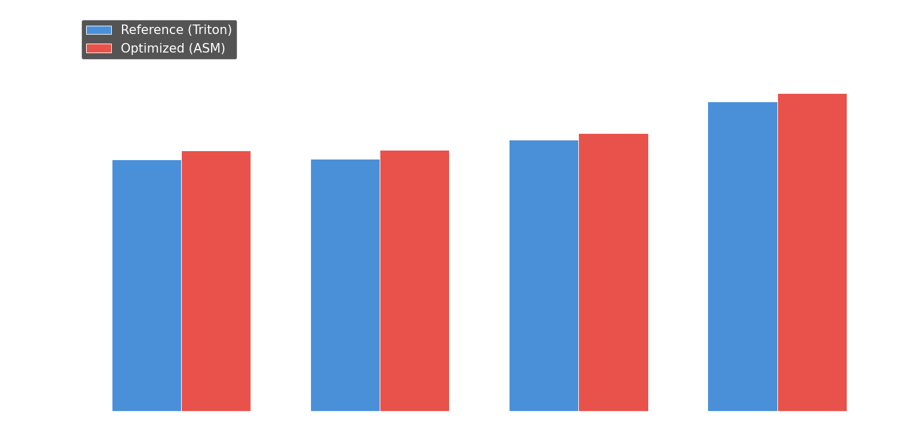

# FP8 Grouped GEMM Persistent FWD/DGRAD — ASM Optimization for MI355X

Hand-tuned AMDGCN assembly optimization of Triton's persistent FP8 grouped GEMM kernel on MI355X (gfx950). Uses `v_mfma_f32_16x16x128_f8f6f4` (128-K MFMA, 2-pass XDL).

## Kernels

| Kernel | File | Description |
|--------|------|-------------|
| **Reference** | `kernels/persistent_gemm_ref.co` | Triton-compiled baseline (Primus v26.2) |
| **Optimized** | `kernels/combined_v5.s` | Hand-tuned assembly, all optimizations combined |

## Performance




C launcher (co_compare.cpp), warmup=50, iters=200. FP8 (e4m3 x e5m2) -> BF16. MI355X (gfx950), ROCm 7.2.0, `rocm/primus:v26.2`.

| Site | Ref (ms) | Opt (ms) | TFLOPS | Speedup |
|------|----------|----------|--------|---------|
| gate_up_fwd (K=2880, N=5760) | 2.272 | 2.218 | 1960 | **+2.4%** |
| down_fwd (K=2880, N=2880) | 1.224 | 1.182 | 1839 | **+3.5%** |
| down_dgrad (K=2880, N=2880) | 1.221 | 1.180 | 1842 | **+3.4%** |
| gate_up_dgrad (K=5760, N=2880) | 1.989 | 1.937 | 2245 | **+2.7%** |

E=32 experts, M_total=131072 tokens (MoE training batch). Correctness: cos=1.000000, max_diff=0.000000 on all sites.

## Optimizations Applied

Three optimization techniques:

### 1. Partial B-side buffer_load hoisting (+2.0%)
The Triton compiler places all 4 B-side `buffer_load_dwordx4` after MFMA #28 (out of 32), giving only ~64 cycles of HBM latency cover. We hoist 2 of the 4 loads to after MFMA #8 using dead VGPRs v[238:245] as alternate destinations, extending cover to ~320 cycles.

Only 2 loads can be hoisted — the other 2 use address registers (v194, v193) that are live across the K-loop.

### 2. Tail MFMA interleaving with ds_write drain (+0.6-0.8%)
The last 4 MFMAs (v[92:95], v[88:91], v[76:79], v[72:75]) are independent of the ds_write drain — they read already-completed LDS data and don't touch any ds_write source registers. Moving them between vmcnt waits fills stall time with useful compute:

```asm
; BEFORE: all ds_writes serial, then all tail MFMAs
  s_barrier
  vmcnt(7) ds_write B0   vmcnt(6) ds_write B1   ...   vmcnt(0) ds_write B7
  MFMA v[92:95]   MFMA v[88:91]   MFMA v[76:79]   MFMA v[72:75]

; AFTER: interleaved
  s_barrier
  MFMA v[92:95]
  vmcnt(7) ds_write B0   vmcnt(6) ds_write B1
  MFMA v[88:91]
  vmcnt(5) ds_write B2   vmcnt(4) ds_write B3
  MFMA v[76:79]
  vmcnt(3) ds_write B4   vmcnt(2) ds_write B5
  MFMA v[72:75]
  vmcnt(1) ds_write B6   vmcnt(0) ds_write B7
```

### 3. s_setprio 3/0 (+0.1-0.3%)
`s_setprio 3` after each s_barrier gives the compute wave higher scheduling priority during the MFMA-heavy section. `s_setprio 0` before buffer_loads yields for memory. Same technique as rocBLAS.

### Compounding

| Step | Marginal | Cumulative |
|------|----------|------------|
| s_setprio | +0.2% | 1.002x |
| + MFMA interleaving | +0.7% | 1.009x |
| + buffer_load hoisting | +2.0% | 1.029x |

Remaining gap to peak (~22-26%) is structural: occupancy 1 (86% stall-bound), barrier overhead (~14%), LDS latency (~5%), loop overhead (~2%).

## What didn't work

| Approach | Result | Why |
|----------|--------|-----|
| Full buffer_load hoisting (all 4 B-loads) | **-9.4%** | Congests memory request queue at loop top |
| ds_read hoisting | 0% | LDS latency already hidden by 16-cycle MFMA |
| NOP removal | 0% | All are hardware-required hazard NOPs |
| MOV elimination (v_add v*,0,v*) | **corrupted** | They're live LDS base address copies |
| s_setprio alone | 0% | Only helps when combined with MFMA interleaving |

## Reproduce

### Requirements

- MI355X GPU (gfx950)
- ROCm 6.x+ with `llvm-mc` (for assembly)

### Build and benchmark

```bash
# Build the C launcher
hipcc -O3 -o co_compare co_compare.cpp

# Assemble optimized kernel from source
/opt/rocm/llvm/bin/llvm-mc -triple=amdgcn-amd-amdhsa -mcpu=gfx950 \
  -filetype=obj -o /tmp/combined.o kernels/combined_v5.s
/opt/rocm/llvm/bin/ld.lld -shared -o kernels/combined_v5.co /tmp/combined.o

# Benchmark all sites
export HIP_VISIBLE_DEVICES=0
for site in gate_up_fwd down_fwd down_dgrad gate_up_dgrad; do
  ./co_compare kernels/persistent_gemm_ref.co kernels/combined_v5.co \
    --benchmark --warmup 50 --iters 200 --site $site
done
```

### Benchmark ref kernel only

```bash
./co_compare kernels/persistent_gemm_ref.co kernels/persistent_gemm_ref.co \
  --benchmark --warmup 50 --iters 200 --site gate_up_fwd
```

## Kernel Architecture

- 96 MFMAs per K-iteration, double-buffered LDS, 8 barriers/iter
- 248 VGPRs, 55 SGPRs, 65536 LDS, 512 threads/WG
- Occupancy 1 → 86% stall-bound, minimal latency hiding
- ASM ceiling is ~74-78% of peak

## Call Sites

FWD: `lhs=(M,K) rhs=(E,N,K) out=(M,N)`. DGRAD: same layout, transposed semantics.

| Site | M | K | N | Dtypes |
|------|---|---|---|--------|
| gate_up_fwd | 131072 | 2880 | 5760 | e4m3 x e5m2 -> bf16 |
| down_fwd | 131072 | 2880 | 2880 | e4m3 x e5m2 -> bf16 |
| down_dgrad | 131072 | 2880 | 2880 | e4m3 x e5m2 -> bf16 |
| gate_up_dgrad | 131072 | 5760 | 2880 | e4m3 x e5m2 -> bf16 |

E=32 experts, M_total=131072 tokens (MoE training batch).

## Files

```
kernels/
  persistent_gemm_ref.co    # Triton-compiled reference (Primus v26.2)
  roundtrip.s               # Byte-identical reassembly of ref .co
  combined_v5.s             # Best optimized kernel (+2.4-3.5%)
  combined_v5.co            # Assembled .co
  disasm.txt                # Full llvm-objdump -d of ref .co
co_compare.cpp              # C/HIP launcher with cosine similarity + benchmarking
tools/
  disasm_to_asm.py          # llvm-objdump → assembleable .s
  patch_co.py               # Splice .text into reference .co
```

## Arg Layout

Both kernels use the same 96-byte argument layout:

```
LHS (ptr), RHS (ptr), C (ptr), LHS_scale (ptr), RHS_scale (ptr), group_offs (ptr),
G (i32), N (i32), K (i32), stride_lhs (i32), stride_rhs (i32),
stride_out0 (i32), stride_out1 (i32), stride_out2 (i32),
global_scratch (ptr, nullptr), profile_scratch (ptr, nullptr)
```

Grid: `(num_cus, 1, 1)`, Block: `(512, 1, 1)`, Shared: `65536`.
